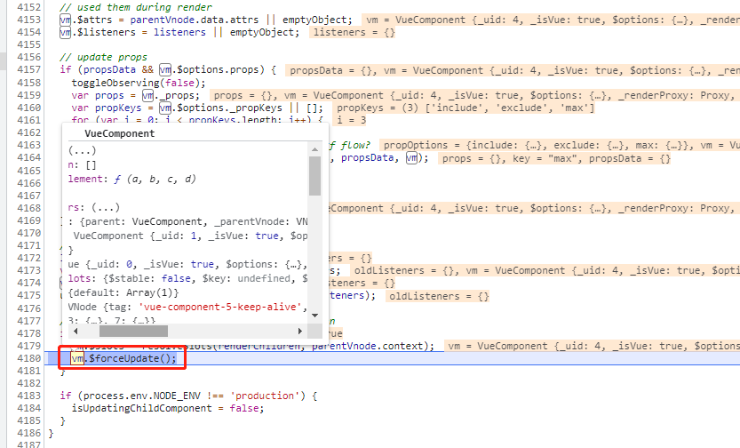

# keep-alive 组件的原理以及 router-view组件的渲染

## 前言

开发项目的时候，我们会碰到希望那些标签的组件实例能够被在它们第一次被创建的时候缓存下来的需求。为了解决这个问题，我们经常使用一个 &lt;keep-alive&gt; 元素将其包裹起来。这样在后续访问这个组件的时候可以使用缓存从而提升了用户体验。但是很少人去关心它的实现原理，这篇文章我们一起来挖掘 &lt;keep-alive&gt; 和 &lt;router-view&gt; 之间的秘密！

## keep-alive

&lt;keep-alive&gt; 是 Vue 的[内置组件](https://cn.vuejs.org/v2/api/#%E5%86%85%E7%BD%AE%E7%9A%84%E7%BB%84%E4%BB%B6),它被定义在 src/core/components/keep-alive.js 中：

```js

//  src/core/components/keep-alive.js

export default {
  name: 'keep-alive',
  abstract: true,

  props: {
    include: patternTypes,
    exclude: patternTypes,
    max: [String, Number]
  },

  methods: {
    cacheVNode() {
      const { cache, keys, vnodeToCache, keyToCache } = this
      if (vnodeToCache) {
        const { tag, componentInstance, componentOptions } = vnodeToCache
        cache[keyToCache] = {
          name: getComponentName(componentOptions),
          tag,
          componentInstance,
        }
        keys.push(keyToCache)
        // prune oldest entry
        if (this.max && keys.length > parseInt(this.max)) {
          pruneCacheEntry(cache, keys[0], keys, this._vnode)
        }
        this.vnodeToCache = null
      }
    }
  },

  created () {
    this.cache = Object.create(null)
    this.keys = []
  },

  destroyed () {
    for (const key in this.cache) {
      pruneCacheEntry(this.cache, key, this.keys)
    }
  },

  mounted () {
    this.cacheVNode()
    this.$watch('include', val => {
      pruneCache(this, name => matches(val, name))
    })
    this.$watch('exclude', val => {
      pruneCache(this, name => !matches(val, name))
    })
  },

  updated () {
    this.cacheVNode()
  },

  render () {
    //用来访问被插槽分发的内容。
    const slot = this.$slots.default
    const vnode: VNode = getFirstComponentChild(slot)
    const componentOptions: ?VNodeComponentOptions = vnode && vnode.componentOptions
    if (componentOptions) {
      // check pattern
      const name: ?string = getComponentName(componentOptions)
      const { include, exclude } = this
      if (
        // not included
        (include && (!name || !matches(include, name))) ||
        // excluded
        (exclude && name && matches(exclude, name))
      ) {
        return vnode
      }

      const { cache, keys } = this
      const key: ?string = vnode.key == null
        // same constructor may get registered as different local components
        // so cid alone is not enough (#3269)
        ? componentOptions.Ctor.cid + (componentOptions.tag ? `::${componentOptions.tag}` : '')
        : vnode.key
      if (cache[key]) {
        vnode.componentInstance = cache[key].componentInstance
        // make current key freshest
        remove(keys, key)
        keys.push(key)
      } else {
        // delay setting the cache until update
        this.vnodeToCache = vnode
        this.keyToCache = key
      }

      vnode.data.keepAlive = true
    }
    return vnode || (slot && slot[0])
  }
}
```

通过源码来看 &lt;keep-alive&gt; 组件是一个对象，通过阅读源码我们了解到 &lt;keep-alive&gt; 组件的主要作用就是用来缓存已经创建过的 vnode 。除此之外它还实现了一些Props：

- include - 字符串或正则表达式。只有名称匹配的组件会被缓存。
- exclude - 字符串或正则表达式。任何名称匹配的组件都不会被缓存。
- max - 数字。最多可以缓存多少组件实例。

我们先看到它还自己实现了 render 方法，在执⾏ &lt;keep-alive&gt; 组件渲染的时候，就会执⾏到这个 render 函数：

```js

const slot = this.$slots.default
const vnode: VNode = getFirstComponentChild(slot)
const componentOptions: ?VNodeComponentOptions = vnode && vnode.componentOptions
```
render 函数逻辑中首先会获取到它的默认插槽，然后再获取到它的第⼀个⼦节点并执行一些处理逻辑。⼀般和它搭配使⽤的有 <font color="#d63200">component</font>  动态组件或者是 <font color="#d63200">router-view</font>。

我们注意到它有一个  <font color="#d63200"> abstract: true </font> 的属性，说明这是一个抽象组件。尤大在官方文档中没有提及，但是我们需要了解的是<font color="#d63200"> &lt;keep-alive&gt; 包裹动态组件时，会缓存不活动的组件实例，而不是销毁它们。和 &lt;transition&gt; 相似，&lt;keep-alive&gt; 是一个抽象组件：它自身不会渲染一个 DOM 元素，也不会出现在组件的父组件链中。</font> 口说无凭，我们在 Vue 源码中可以查证，也就是在 lifecycle.js 中的 initLifecycle 方法能看到：

```js
// src/core/instance/lifecycle.js

//代码片段
export function initLifecycle (vm: Component) {
  const options = vm.$options

  // locate first non-abstract parent
  let parent = options.parent
  if (parent && !options.abstract) {
    //抽象组件在组件实例建⽴⽗⼦关系的时候会被忽略
    while (parent.$options.abstract && parent.$parent) {
      parent = parent.$parent
    }
    parent.$children.push(vm)
  }

  vm.$parent = parent
  vm.$root = parent ? parent.$root : vm

  vm.$children = []
  vm.$refs = {}

  vm._watcher = null
  vm._inactive = null
  vm._directInactive = false
  vm._isMounted = false
  vm._isDestroyed = false
  vm._isBeingDestroyed = false
}

```

## 组件渲染

为了演示我创建了一个项目 keep-alive 来作说明。以下是我项目大致目录结构：


```js
keep-alive
├─ .gitignore
├─ README.md
├─ babel.config.js
├─ package-lock.json
├─ package.json
├─ public
│  ├─ favicon.ico
│  └─ index.html
└─ src
   ├─ App.vue
   ├─ assets
   │  └─ logo.png
   ├─ components
   │  ├─ tab-archive.vue
   │  └─ tab-posts.vue
   ├─ lifecycle.js
   ├─ main.js
   ├─ router
   │  └─ index.js
   ├─ styles
   │  └─ index.css
   └─ views
      ├─ PageHome.vue
      └─ PageIndex.vue
```
我的这个项目主要由两个一级页面 index 和 home 组成。index page是一个动态组件生成的内容，home page 是一个包含了两个子页面的内容展示。

index page


home page


再来看下我的router.js

```js
// src/router/index.js

import Vue from "vue";
import VueRouter from "vue-router";
import PageIndex from "@/views/PageIndex";
import PageHome from "@/views/PageHome";

Vue.use(VueRouter);

const routes = [
    {
        path: "/",
        component: PageIndex,
    },
    {
        path: "/home",
        component: PageHome,
    }
]

export default new VueRouter({
    routes,
})
```

还有一个 lifecycle.js 用于在控制台中输出每个 Vue 组件实例的created、activated、deactivated、destroyed等相关的生命周期钩子。

```js
// src/lifecycle.js

export default {
    created(){
        console.log(`${this.$options.name} created`);
    },
    mounted() {
        console.log(`${this.$options.name} mounted`);
    },
    activated() {
        console.log(`${this.$options.name} activated`);
    },
    deactivated() {
        console.log(`${this.$options.name} deactivated`);
    },
    destroyed() {
        console.log(`${this.$options.name} destroyed`);
    }
}

```

## 不使用keep-alive

我们先看看App.vue文件

```js
// src/App.vue

<template>
<div id="app">
    <div class="navigation">
        <router-link to="/">to index</router-link>
        <router-link to="/home">to home</router-link>
    </div>
    <keep-alive>
        <router-view></router-view>
    </keep-alive>
</div>
</template>

<script>
export default {
    name: 'App',
}
</script>

<style>
</style>


```

npm run serve 之后打开我们的页面。我们先在index页面的选项卡中点击 Hipster Ipsum 的内容：


 
再从 index 切换到 home 页面看看控制台输出的信息:

```js

index created
index mounted
home created
index destroyed
home mounted
```
<font color="#d63200">这里要特别注意的是 index 组件执行到了 destroyed 钩子函数。</font>

接着我们再来看看从home page 切回到 index page 控制台会输出什么：


```js
index created
home destroyed
index mounted
```
<font color="#d63200">home 组件执行到了 destroyed 钩子函数, index 组件又执行了 created、mounted。</font>

因此可以解释为什么我们先前在index page中查看的Hipster Ipsum的内容被重新渲染了。

**好了，现在我们来提个新需求：在index page和home page之间来回切换的时候页面能够“记住”我们上一次浏览的内容。**

这个嘛，简直不要太简单了！直接上 keep-alive！

## 使用keep-alive

我们使用 keep-alive 来缓存我们的组件，于是可以修改下App.vue文件：

```vue
// src/App.vue

<template>
<div id="app">
    <div class="navigation">
        <router-link to="/">to index</router-link>
        <router-link to="/home">to home</router-link>
    </div>
    <!-- 使用keep-alive缓存组件  -->
    <keep-alive>
        <router-view></router-view>
    </keep-alive>
</div>
</template>

<script>
export default {
    name: 'App',
}
</script>

<style>
</style>

```

再次运行后先点击index页面的 Hipster Ipsum 选项卡，然后点击 home 页面，最后再回到 index 页面。

我们就能看到已经实现了组件被缓存，最直观的想象就是我们先前在 index 组件中浏览过的选项卡内容没有被重置。于是我们的需求就被实现了！


我们分两种情况来分析：
- 第一种情况是从index组件过渡到home组件
  - 首先index组价分别执行了生命周期钩子函数 created、mounted、activated
  - 接着home组件执行了生命周期钩子created
  - 再接着index组价执行生命周期钩子deactivated
  - 最后执行home组件的mounted、activated

```js

index created
index mounted
index activated
home created
index deactivated
home mounted
home activated
```


- 第二种情况是从home组件切回到index组件
  - 先执行home组件的生命周期钩子deactivated
  - 再执行index组价的生命周期钩子activated

```js
home deactivated
index activated
```


<font color="#d63200">总结刚才的演示过程发生了什么：使用keep-alive组件包裹的子组件在首次渲染的时候和会执行到created、mounted、activated钩子，所以组件在⾸次渲染的情况，使用 keep-alive 渲染和普通渲染的区别就是 keep-alive 会缓存组件的 vnode。最后在 index 组件失活的时候并不会被销毁而是被 keep-alive 组件缓存了这个时候组件执行了deactivated钩子。当子组件被重用的时候会调用activated生命周期钩子函数。</font>

## 断点调试 keep-alive

接下来我们通过断点调试的方法来看看。

在我们的项目的node_modules中先找到 vue/dist/vue.runtime.esm.js,打开文件并搜索 “KeepAlive” 组件。我们在render方法中debugger(大概在vue.runtime.esm.js文件的第5380行的位置),还有就是componentVNodeHooks.insert 和 componentVNodeHooks.destroy 方法中打上debugger（分别是第3161行和3176行的位置）

```js
// node_modules/vue/dist/vue.runtime.esm.js

render: function render () {
    debugger
    var slot = this.$slots.default;
    var vnode = getFirstComponentChild(slot);
    var componentOptions = vnode && vnode.componentOptions;
    if (componentOptions) {
      // check pattern
      var name = getComponentName(componentOptions);
      var ref = this;
      var include = ref.include;
      var exclude = ref.exclude;
      if (
        // not included
        (include && (!name || !matches(include, name))) ||
        // excluded
        (exclude && name && matches(exclude, name))
      ) {
        return vnode
      }

      var ref$1 = this;
      var cache = ref$1.cache;
      var keys = ref$1.keys;
      var key = vnode.key == null
        // same constructor may get registered as different local components
        // so cid alone is not enough (#3269)
        ? componentOptions.Ctor.cid + (componentOptions.tag ? ("::" + (componentOptions.tag)) : '')
        : vnode.key;
      if (cache[key]) {
        vnode.componentInstance = cache[key].componentInstance;
        // make current key freshest
        remove(keys, key);
        keys.push(key);
      } else {
        // delay setting the cache until update
        this.vnodeToCache = vnode;
        this.keyToCache = key;
      }

      vnode.data.keepAlive = true;
    }
    return vnode || (slot && slot[0])
  }
```

```js
// node_modules/vue/dist/vue.runtime.esm.js

var componentVNodeHooks = {
  init: function init (vnode, hydrating) {
    if (
      vnode.componentInstance &&
      !vnode.componentInstance._isDestroyed &&
      vnode.data.keepAlive
    ) {
      // kept-alive components, treat as a patch
      var mountedNode = vnode; // work around flow
      componentVNodeHooks.prepatch(mountedNode, mountedNode);
    } else {
      var child = vnode.componentInstance = createComponentInstanceForVnode(
        vnode,
        activeInstance
      );
      child.$mount(hydrating ? vnode.elm : undefined, hydrating);
    }
  },

  prepatch: function prepatch (oldVnode, vnode) {
    var options = vnode.componentOptions;
    var child = vnode.componentInstance = oldVnode.componentInstance;
    updateChildComponent(
      child,
      options.propsData, // updated props
      options.listeners, // updated listeners
      vnode, // new parent vnode
      options.children // new children
    );
  },

  insert: function insert (vnode) {
    var context = vnode.context;
    var componentInstance = vnode.componentInstance;
    if (!componentInstance._isMounted) {
      componentInstance._isMounted = true;
      callHook(componentInstance, 'mounted');
    }
    if (vnode.data.keepAlive) {
      debugger
      if (context._isMounted) {
        // vue-router#1212
        // During updates, a kept-alive component's child components may
        // change, so directly walking the tree here may call activated hooks
        // on incorrect children. Instead we push them into a queue which will
        // be processed after the whole patch process ended.
        queueActivatedComponent(componentInstance);
      } else {
        activateChildComponent(componentInstance, true /* direct */);
      }
    }
  },

  destroy: function destroy (vnode) {
    debugger
    var componentInstance = vnode.componentInstance;
    if (!componentInstance._isDestroyed) {
      if (!vnode.data.keepAlive) {
        componentInstance.$destroy();
      } else {
        deactivateChildComponent(componentInstance, true /* direct */);
      }
    }
  }
};
```

### keep-alive首次渲染

重新运行项目并打开index组件：

执行到keep-alive 组件的render的时候，它会拿到 FirstComponentChild（也就是我们的 index 组件）去执行

```js
this.vnodeToCache = vnode;
this.keyToCache = key;
vnode.data.keepAlive = true;
```
也就是缓存子组件 index 的 vnode，并且设置了vnode.data.keepAlive = true;


我们接着往下看在执行到 activateChildComponent(componentInstance, true /* direct */);的时候就会调用index组件的 activated 生命周期钩子。


我们看到源码中的activateChildComponent定义：

```js
// src/core/instance/lifecycle.js

export function activateChildComponent (vm: Component, direct?: boolean) {
  if (direct) {
    vm._directInactive = false
    if (isInInactiveTree(vm)) {
      return
    }
  } else if (vm._directInactive) {
    return
  }
  if (vm._inactive || vm._inactive === null) {
    vm._inactive = false
    for (let i = 0; i < vm.$children.length; i++) {
      activateChildComponent(vm.$children[i])
    }
    callHook(vm, 'activated')
  }
}

```

由于在执行activateChildComponent(componentInstance, true /* direct */)传的第二个参数为 true，因此会将index组件的实例上设置一个_directInactive = false 的值。并且由于执行initLifecycle (vm)的时候vm._inactive的初始值为null，所以最后还会执行到callHook(vm, 'activated')。这就是为什么index组件会执行 activated 生命周期钩子。


经过上述执行流程，我们看到控制台依次输出了：

```js

index created
index mounted
index activated
```

<font color="#d63200">所以对于keep-alive包裹的组件⾸次渲染，除了在 keep-alive 中建⽴缓存，并且该组件执行了 created 和 activated 这两个生命周期钩子。</font>

### keep-alive缓存渲染

最后再点击 to index， 从 home page 回到 index page。**这个时候失活的是 home 组件，被激活的是 index 组件。**


我们接着往下执行，直到执行到home组件的 destroy 钩子。这里请注意了，由于vnode.data.keepAlive这个时候为true。因此destroy的逻辑并不会调用组件的$destroy()方法，而是走deactivateChildComponent(componentInstance, true /* direct */);逻辑。

deactivateChildComponent方法的源码也是定义在lifecycle.js文件中：

```js
// src/core/instance/lifecycle.js


export function deactivateChildComponent (vm: Component, direct?: boolean) {
  if (direct) {
    vm._directInactive = true
    if (isInInactiveTree(vm)) {
      return
    }
  }
  if (!vm._inactive) {
    vm._inactive = true
    for (let i = 0; i < vm.$children.length; i++) {
      deactivateChildComponent(vm.$children[i])
    }
    callHook(vm, 'deactivated')
  }
}
```

所以执行了deactivateChildComponent(componentInstance, true /* direct */) 就会将vm._directInactive设置为true。并且此时会将home组件的_inactive设置为true。最后执行callHook(vm, 'deactivated')。所以控制台会输出home deactivated。


<font color="#d63200"> **最后我们看对于 index 组件而言其实是一个新旧 vnode 的 diff 过程。** diff 的过程就是执行 patchVnode ，patchVnode 会先执⾏ prepatch 的钩⼦函数， prepatch 主要业务就是执⾏ updateChildComponent ⽅法。updateChildComponent ⽅法则会触发keep-alive 组件执行 $forceUpdate 逻辑，也就是重新执⾏keep-alive 的 render ⽅法。keep-alive 组件执行 render ⽅法的时候如果它包裹的第⼀个组件 vnode 命中缓存，则直接返回缓存中的 vnode.componentInstance。在我们的例⼦中就是缓存的 index 组件，接着⼜会执⾏ patch 过程，再次执⾏到 createComponent ⽅法。再次执行到 createComponent 的时候组件实例的 vnode.componentInstance 还有 isReactivated 都为 true。因此在执⾏ init 钩⼦函数的时候不会再去执⾏组件的 mount 过程了。</font>

所以我们看到控制台只输出了:
```js

home deactivated
index activated
```

1. updateChildComponent 触发 keep-alive 组件执行 $forceUpdate 逻辑:


2. keep-alive 组件执行 $forceUpdate 就会重新执行 keep-alive 的 render 方法：


3. 此时执行 render 方法，index 组件命中缓存：


4. 再次执行到 createComponent 的时候组件实例的 vnode.componentInstance 还有 isReactivated 都为 true。因此在执⾏ init 钩⼦函数的时候不会再去执⾏组件的 mount 过程了。这就解释了为什么从home组件回到index组件的时候没有执行index created 和 index mounted 的原因了。

```js
function createComponent (vnode, insertedVnodeQueue, parentElm, refElm) {
    var i = vnode.data;
    if (isDef(i)) {
      var isReactivated = isDef(vnode.componentInstance) && i.keepAlive;
      if (isDef(i = i.hook) && isDef(i = i.init)) {
        i(vnode, false /* hydrating */);
      }
      // after calling the init hook, if the vnode is a child component
      // it should've created a child instance and mounted it. the child
      // component also has set the placeholder vnode's elm.
      // in that case we can just return the element and be done.
      if (isDef(vnode.componentInstance)) {
        initComponent(vnode, insertedVnodeQueue);
        insert(parentElm, vnode.elm, refElm);
        if (isTrue(isReactivated)) {
          reactivateComponent(vnode, insertedVnodeQueue, parentElm, refElm);
        }
        return true
      }
    }
  }
```

```js
// inline hooks to be invoked on component VNodes during patch
var componentVNodeHooks = {
  init: function init (vnode, hydrating) {
    if (
      vnode.componentInstance &&
      !vnode.componentInstance._isDestroyed &&
      vnode.data.keepAlive
    ) {
      // kept-alive components, treat as a patch
      var mountedNode = vnode; // work around flow
      componentVNodeHooks.prepatch(mountedNode, mountedNode);
    } else {
      var child = vnode.componentInstance = createComponentInstanceForVnode(
        vnode,
        activeInstance
      );
      child.$mount(hydrating ? vnode.elm : undefined, hydrating);
    }
  },
  // ...
};
```

prepatch：
```js
// src/core/vdom/create-component.js

//inline hooks to be invoked on component VNodes during patch
const componentVNodeHooks = {
  //  ...
  prepatch (oldVnode: MountedComponentVNode, vnode: MountedComponentVNode) {
    const options = vnode.componentOptions
    const child = vnode.componentInstance = oldVnode.componentInstance
    updateChildComponent(
      child,
      options.propsData, // updated props
      options.listeners, // updated listeners
      vnode, // new parent vnode
      options.children // new children
    )
  },
}
```

reactivateComponent 最终会去执行 insert(parentElm, vnode.elm, refElm); 

insert(parentElm, vnode.elm, refElm) 会把缓存的 index 组件直接插⼊到⽬标元素中，于是这样就完成了 index 组件的渲染过程。

```js
function reactivateComponent (vnode, insertedVnodeQueue, parentElm, refElm) {
  var i;
  // hack for #4339: a reactivated component with inner transition
  // does not trigger because the inner node's created hooks are not called
  // again. It's not ideal to involve module-specific logic in here but
  // there doesn't seem to be a better way to do it.
  var innerNode = vnode;
  while (innerNode.componentInstance) {
    innerNode = innerNode.componentInstance._vnode;
    if (isDef(i = innerNode.data) && isDef(i = i.transition)) {
      for (i = 0; i < cbs.activate.length; ++i) {
        cbs.activate[i](emptyNode, innerNode);
      }
      insertedVnodeQueue.push(innerNode);
      break
    }
  }
  // unlike a newly created component,
  // a reactivated keep-alive component doesn't insert itself
  insert(parentElm, vnode.elm, refElm);
}
```

### router-view 对于缓存组件渲染的处理逻辑

接着我们在node_modules中先找到 vue-router/dist/vue-router.esm.js,打开文件并搜索 “RouterView” 组件。我们在render方法中找到while语句对于keep-alive的处理逻辑打上debugger。（大约在331行的位置还有343行的位置）
```js
//  vue-router/src/components/view.js

render (_, { props, children, parent, data }) {
    // used by devtools to display a router-view badge
    data.routerView = true

    // directly use parent context's createElement() function
    // so that components rendered by router-view can resolve named slots
    const h = parent.$createElement
    const name = props.name
    const route = parent.$route
    const cache = parent._routerViewCache || (parent._routerViewCache = {})

    // 确定当前视图深度，同时检查树是否已切换为失活状态但保持活跃。
    let depth = 0
    let inactive = false
    // 一直往上找父组件，知道父组件是 Vue 实例为止。这里面的主要逻辑是确定routerView的嵌套层级和是否有缓存组件
    while (parent && parent._routerRoot !== parent) {
      const vnodeData = parent.$vnode ? parent.$vnode.data : {}
      if (vnodeData.routerView) {
        depth++
      }
      // 当使用了keep-alive并且父组件的_directInactive和_inactive都为true的时候就使用缓存渲染
      if (vnodeData.keepAlive && parent._directInactive && parent._inactive) {
        debugger
        inactive = true
      }
      parent = parent.$parent
    }
    data.routerViewDepth = depth

    // 如果树处于失活状态且保持活跃，则渲染上一个视图
    if (inactive) {
      const cachedData = cache[name]
      const cachedComponent = cachedData && cachedData.component
      if (cachedComponent) {
        debugger
        // #2301
        // pass props
        if (cachedData.configProps) {
          fillPropsinData(cachedComponent, data, cachedData.route, cachedData.configProps)
        }
        return h(cachedComponent, data, children)
      } else {
        // render previous empty view
        return h()
      }
    }

    // ...
  }
```

接着我们给home组件增加一个子组件 home-child。

```vue
<template>
  <div>home child: {{$route.params.id}}</div>
</template>

<script>
import lifecycle from '@/lifecycle'
export default {
    mixins: [lifecycle],
    name:"homeChild",
    beforeRouteUpdate (to, from, next) {
      console.log('to.params.id: ', to.params.id);
      next()
    }
}
</script>

<style>

</style>
```

并且给home组件增加一个子路由。修改后的 router/index.js：

```js
import Vue from "vue";
import VueRouter from "vue-router";
import PageIndex from "@/views/PageIndex";
import PageHome from "@/views/PageHome";
import homeChild from "@/components/home-child";

Vue.use(VueRouter);

const routes = [
  {
    path: "/",
    name: "index",
    component: PageIndex,
  },
  {
    path: "/home",
    name: "home",
    component: PageHome,
    children: [
      {
        path: "homeChild/:id",
        name: "homeChild",
        component: homeChild,
      },
    ],
  },
];

export default new VueRouter({
  routes,
});

```

给home组件添加一个router-view ：

```js
// src/views/PageHome.vue

<template>
<div>
    <h1>HOME PAGE</h1>
    <router-view></router-view>
</div>
</template>

<script>
import lifecycle from '@/lifecycle';
export default {
    name: "home",
    mixins: [lifecycle]

}
</script>

<style>
</style>

```
最后修改下 App.vue：

```vue
<template>
<div id="app">
    <div class="navigation">
        <router-link to="/">to index</router-link>
        <router-link to="/home">to home</router-link>
        <router-link to="/home/homeChild/foo">/home/homeChild/foo</router-link>
    </div>
    <keep-alive>
        <router-view></router-view>
    </keep-alive>
</div>
</template>

<script>
export default {
    name: 'App',
}
</script>

<style>
</style>

```
重新运行项目，我们先从 “/” 路径切换到 "/home/homeChild/foo" 路径。然后先打开控制台，最后再点击“to index” 回到index组件。这时候断点停留在 vnodeData.keepAlive && parent._directInactive && parent._inactive 的逻辑。


这时候 inactive 被设置为 true 。并且代码执行到 inactive =  true 的逻辑。我们看到 homeChild 的 router-view 组件使用了缓存渲染。


